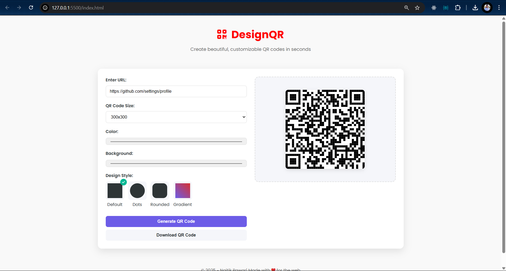

# DesignQr
Features: ✨ 4 design styles 🎨 Custom colors 📏 Size adjustment ⬇️ One-click download 📱 Mobile-friendly
# 🎯 Stylish QR Code Generator

Turn any URL into a beautifully styled QR code in seconds!  
Easily customize colors, shapes, and even add your own logo for a personal touch.

  click here [🚀 Live Website](https://design-qr-sigma.vercel.app/)

---

## ✨ Features

- 🔗 **Instant URL to QR** conversion  
- 🎨 **Custom QR designs** (choose dot style, color, and border)
- 🖼️ **Add your own logo** inside the QR code
- ⚡ **Live Preview** as you customize
- 📥 **Download your QR code** as a PNG

---

## 💡 How to Use

1. Enter your URL.
2. Pick your favorite design style and color.
3. Upload a logo if you want.
4. Click **Generate** → Preview your QR.
5. Click **Download** to save your unique QR code!

---

## 📂 Tech Stack

- HTML, CSS, JavaScript  
- [QR Code Styling JS Library](https://github.com/kozakdenys/qr-code-styling)  
- Hosted on [Vercel](https://vercel.com)

---

## 🧠 Creator

Made with ❤️ by **Naitik**

---

## 🪄 Screenshot

---

## 🏷 License

This project is open-source and free to use.
